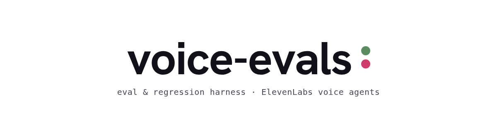
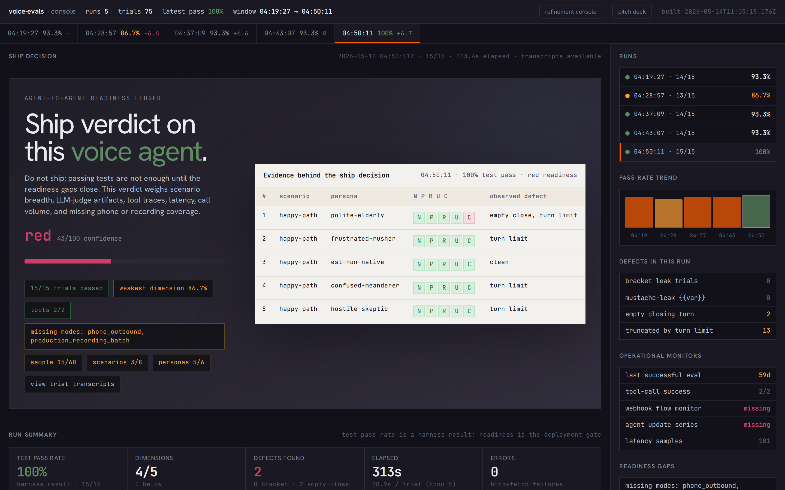
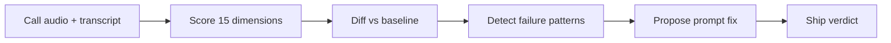
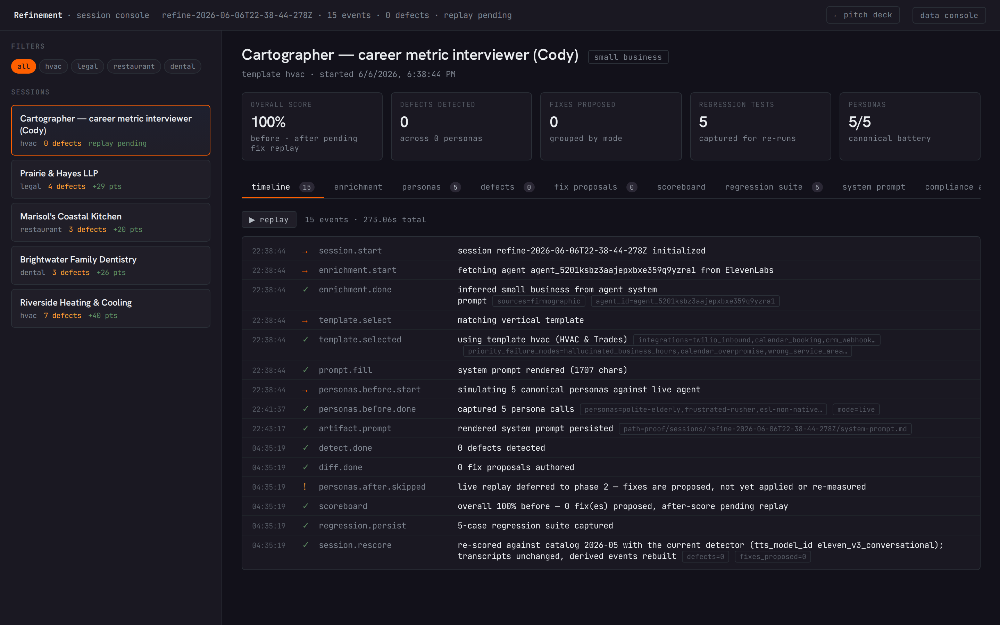

<div align="center">

<picture>
  <source media="(prefers-color-scheme: dark)" srcset="docs/media/voice-evals-wordmark-dark.png">
  
</picture>

#### voice agent evals · audio scoring · LLM judges · regression baselines · prompt refinement

# Ship verdict on this voice agent.

An eval and regression harness for ElevenLabs Conversational AI agents. Every run ends in a verdict artifact.

**[Quick start](#quick-start)** | **[How a run flows](#how-a-run-flows)** | **[Scoring](#scoring-dimensions)** | **[Failure patterns](#failure-patterns)** | **[Proof console](#proof-console)** | **[Status](#status)** | **[What ships](#what-ships)**

[](https://github.com/wranngle/voice_ai_agent_evals/actions/workflows/vitest.yml)
[](LICENSE)
[](https://github.com/wranngle/voice_ai_agent_evals/commits/main)



*The proof console rendering a ship decision.*

</div>

Written in TypeScript, run with Bun. It scores call audio and transcripts, captures versioned baselines, diffs new runs against them, and runs a closed-loop prompt-fix cycle against a DEV agent. Bring your own agent ID and a scenario file; get pass/fail with assertion-level detail and one of two closing words: ship, or do not ship.

- 🎧 **Audio-native scoring** on WAV PCM (16/24/32-bit, mono or stereo): energy-threshold VAD, two-stream barge-in, SNR, autocorrelation pitch, speech rate
- 🧑‍⚖️ **LLM judges** (`g-eval`, `arena`, `dag`, `lynx`) behind injected model callbacks, deterministic heuristics in CI
- 📉 **Versioned baselines** with Braintrust-shaped diffs; gate CI on `regressions.length`
- 🔍 **Failure-pattern detectors** with context-aware regex: negation lookahead for genuine declines, agent-quote suppression
- 🔁 **Closed-loop refinement**: persona calls, failure catalog, plain-language prompt diffs, before and after rescoring, compliance artifact
- 🛡️ **`[PHASE]` governance gate** so mutations only land on agents you explicitly tag for them

## Quick start

No keys, no config, fully offline.

1. Install and run the demo:

   ```bash
   bun install
   bun run src/cli.ts demo
   ```

   It synthesizes a short stereo fixture (caller left, agent right), runs the voice-activity and barge-in scorers, prints a scorecard, and writes an HTML report. Deterministic.

2. Serve the proof console (session timelines, transcripts, scoreboards, compliance artifacts fetch live data, so the HTML must be served):

   ```bash
   bun run proof   # http://localhost:4173/refine.html
   ```

3. To point at a live agent, copy `agent-registry.example.yaml` to `agent-registry.yaml` (gitignored) and fill in real IDs, or set `ELEVENLABS_AGENT_ID`.

## How a run flows



## Scoring dimensions

| 🎧 Audio (6) | 💬 Dialog (2) | 🧑‍⚖️ LLM rubric (7) |
|---|---|---|
| voice activity | not-early-termination | intent recognition |
| barge-in | containment rate | instruction following |
| AI interrupting user | | task completion |
| signal-to-noise ratio | | first-call resolution |
| average pitch | | customer satisfaction |
| speech rate | | AI-to-human handoff |
| | | response consistency |

<div align="center">

| 1245 | 105 | 15 | 5 | 0 |
|:---:|:---:|:---:|:---:|:---:|
| offline tests | test files | scoring dimensions | failure patterns | secrets required |

</div>

## Failure patterns

Five detectors, each shipping a targeted prompt or temperature fix:

| Detector | Catches |
|---|---|
| `SMS_AFTER_DECLINE` | agent texts after the caller declines SMS contact |
| `TOOL_NOT_CALLED` | agent narrates an action without invoking the matching tool |
| `CONTEXT_LOST` | agent re-asks for details the caller already gave |
| `HOSTILE_RESPONSE` | hostile, defensive, or condescending agent tone |
| `INCONSISTENT_BEHAVIOR` | failing-test count varies across iterations, flagging non-determinism |

Works on transcripts from ElevenLabs post-call webhooks, mocked persona fixtures, or any conversation shaped like turns and tool calls. The verdict weighs scenario breadth, judge artifacts, tool traces, latency, and coverage gaps, then closes with ship or do not ship.

## Proof console

<div align="center">



*Session scoreboard with before and after dimension scores.*

</div>

## Status

Research and personal-tool stage. This is a solo build by one operator (Wranngle), with no external users and no published npm package; install from source. The code under `src/` works and is exercised by the offline suite on every push and a daily cron, but treat it as an experimental harness, not a hardened product.

The honest gaps:

- **GEPA prompt-optimization sidecar is a stub.** `runGepaOptimization()` throws `GepaUnavailableError`; the closed-loop `polishLoop` works today against a single-shot LLM proposer, not GEPA.
- **ElevenLabs and n8n integration tests use mocked clients.** The live scripts under `scripts/` hit real endpoints but run standalone, not in CI.
- **Audio support is WAV PCM only.** No mu-law / G.711 / a-law parser, so mono call recordings fall back to single-channel VAD with no barge-in.
- **LLM judges run deterministic heuristics in CI.** `g-eval`, `arena`, and `dag` accept a judge callback but CI does not call a live model.

## What ships

**Audio scoring (`src/scoring/audio.ts`).** Pure functions over WAV PCM: `parseWav`, `rmsEnvelope`, energy-threshold VAD, two-stream barge-in detection, plus dimension scorers for voice activity, barge-in, AI-interrupting-user, SNR, average pitch, and speech rate. No filesystem I/O.

**Scoring composer and assertions (`src/scoring/`).** A composable `Task = (dataset, caller, scorer)` model with `compose`, `weighted`, and `aggregate`; an assertions DSL (`contains`, `regex`, `equals`, `not`, `llmRubric`); and the four LLM judges with injected model callbacks.

**ElevenLabs wrapper with governance (`src/wrapper/`).** `createVoiceEvalsClient` wraps agent CRUD behind the `[PHASE]` name-tag gate, tool-schema sanitization (`cleanTools`), a model-rankings ban list, and an HMAC webhook signature verifier.

**Regression baselines and diff (`src/regression/`).** Capture a versioned baseline, then `diffAgainstBaseline` produces a Braintrust-shaped diff (per-test, per-dimension, improvements / regressions / unchanged / new / dropped). Pure function.

**Refinement engine (`src/refinement/`).** The pipeline behind the proof console: enrich business context, select a vertical template, fill the system prompt, run persona calls (deterministic fixtures with `--mock`, or `simulateConversation` with `--agent-id`), detect failures against the catalog, build plain-language prompt diffs, re-run and rescore, then emit the compliance artifact, regression suite, and session JSON.

**Ingestion (`src/ingestion/`).** Post-call webhook importer that turns a production payload into test cases, an LLM-driven test proposer, canonical personas with audio traits, and a deterministic random scenario generator.

**Closed-loop remediation (`src/remediation/`).** `polishLoop` runs an EVALUATE to ANALYZE to PROPOSE to APPLY to VERIFY to LOG cycle and returns dimension-level deltas, plus the five failure-pattern detectors and an append-only friction log.

**Test factory (`src/factory/`).** Combinatorial expansion (`cartesian`, `pairwise`, `kWise`, seeded `sample`) over YAML templates with placeholder interpolation and overlay merging.

**n8n auto-corrector (`src/n8n/`).** `createN8nCorrector` diagnoses workflow failures and applies partial updates (retry, error handling, timeout, webhook-data fixes).

**CLI (`src/cli.ts`).** Verbs: `init`, `demo`, `score`, `ingest`, `polish`, `refine`, `ceo-demo`, `baseline`, `compare`, `doctor`, `factory`, `agent`, `friction`, `n8n`, `webhooks`, `scenarios`, `legacy`. Each verb has `--help`.

<details>
<summary><b>Library use (from source)</b></summary>

```ts
import {
  parseWav,
  scoreBargeIn,
  importPostCallWebhook,
  captureBaseline,
  diffAgainstBaseline,
  polishLoop,
} from './src/index';

// Audio-native barge-in scoring on a stereo WAV (caller=L, agent=R).
const wav = parseWav(await Bun.file('post-call.wav').arrayBuffer());
const dim = scoreBargeIn({
  callerSamples: wav.channelSamples![0],
  agentSamples: wav.channelSamples![1],
  sampleRate: wav.sampleRate,
  maxOverlapMs: 250,
});

// Turn a production webhook payload into test cases.
const {cases} = importPostCallWebhook(postCallWebhookJson);

// Closed-loop polish on a [DEV]-tagged agent (governance-gated, dry run).
await polishLoop({
  client,
  agentId: 'agent_xxxx_demo',
  evaluate: async () => myEvalSuite(), // returns DimensionScore[]
  llm: async ({system, user}) => myLlmCallback(system, user),
  maxIterations: 3,
  dryRun: true,
});
```

The flat `src/index.ts` barrel re-exports the public surface; the same modules are importable directly from `src/scoring`, `src/wrapper`, `src/regression`, `src/ingestion`, `src/refinement`, `src/remediation`, `src/factory`, and `src/n8n`.

</details>

## Gate merges on voice-evals score

The gating workflow template lives at [`.github/workflows/voice-evals-gate.yml.template`](.github/workflows/voice-evals-gate.yml.template). Drop it into any repo that ships a voice agent:

```bash
mkdir -p .github/workflows
curl -fsSL https://raw.githubusercontent.com/wranngle/voice_ai_agent_evals/main/.github/workflows/voice-evals-gate.yml.template \
  -o .github/workflows/voice-evals-gate.yml
git add .github/workflows/voice-evals-gate.yml && git commit -m "ci: gate PRs on voice-evals"
```

The template runs the harness from source (the package is not on npm) and gates on the pass rate of the scenario fixtures committed under your repo's `tests/scenarios/<id>/scenario.yaml`. With zero fixtures the gate fails closed with instructions. No secrets required; the scenario runner is fixture-driven and offline.

## Tests

```bash
bun install

# Offline unit + integration tests (mocked fetch, no secrets).
bun run test:offline

# Live scripts that hit real endpoints (need API keys; run locally).
bun run testing:live:el    # ElevenLabs simulate-conversation
bun run testing:live:n8n   # your n8n webhook host
bun run testing:live:mcp   # your n8n MCP-style workflow

# Scenario harness (scenario YAML + .test-data flow).
bun run testing list
bun run testing run -t scenario   # nonzero exit if a committed scenario fails
```

## Star history

<div align="center">

<!--
The server-rendered chart image is down: api.star-history.com returns 404
during an outage. This falls back to the live star badge linked to
star-history's client-side page, which still draws the chart during the API
outage. Restore this line when api.star-history.com recovers:
[](https://www.star-history.com/#wranngle/voice_ai_agent_evals&Date)
-->

[](https://www.star-history.com/#wranngle/voice_ai_agent_evals&Date)

[**View the interactive star history**](https://www.star-history.com/#wranngle/voice_ai_agent_evals&Date), drawn live even while star-history's image API is down.

</div>

## License

MIT. See [`LICENSE`](LICENSE).
