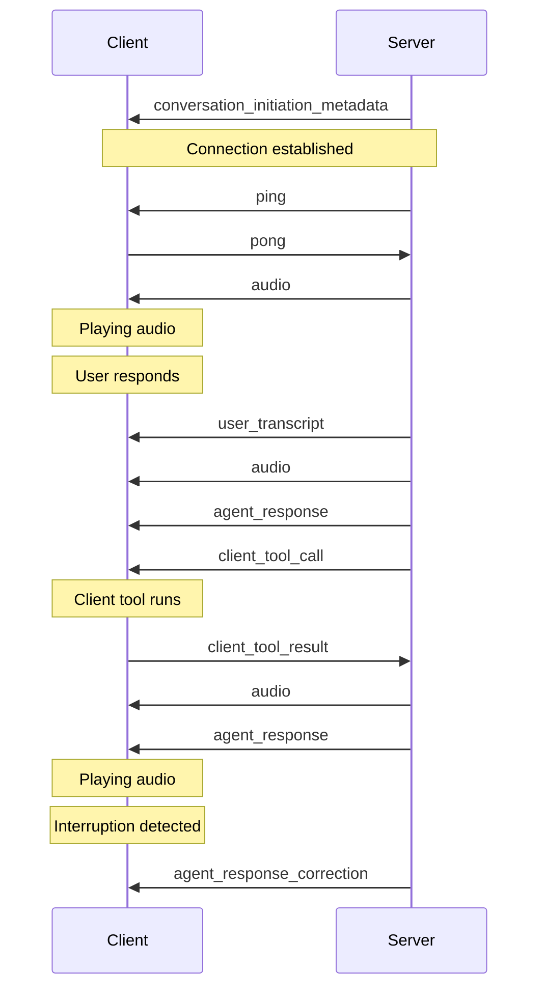

> This is a page from the ElevenLabs documentation. For a complete page index, fetch https://elevenlabs.io/docs/llms.txt. For the full documentation in a single file, fetch https://elevenlabs.io/docs/llms-full.txt.

# Client events

**Client events** are system-level events sent from the server to the client that facilitate real-time communication. These events deliver audio, transcription, agent responses, and other critical information to the client application.

For information on events you can send from the client to the server, see the [Client-to-server
events](/docs/eleven-agents/customization/events/client-to-server-events) documentation.

## Overview

Client events are essential for maintaining the real-time nature of conversations. They provide everything from initialization metadata to processed audio and agent responses.

These events are part of the WebSocket communication protocol and are automatically handled by our
SDKs. Understanding them is crucial for advanced implementations and debugging.

## Client event types

* Automatically sent when starting a conversation
* Initializes conversation settings and parameters

```json
// Example initialization metadata
{
  "type": "conversation_initiation_metadata",
  "conversation_initiation_metadata_event": {
    "conversation_id": "conv_123",
    "agent_output_audio_format": "pcm_44100",  // TTS output format
    "user_input_audio_format": "pcm_16000"    // ASR input format
  }
}
```

* Health check event requiring immediate response
* Automatically handled by SDK
* Used to maintain WebSocket connection

```json
  // Example ping event structure
  {
    "ping_event": {
      "event_id": 123456,
      "ping_ms": 50  // Optional, estimated latency in milliseconds
    },
    "type": "ping"
  }
```

```javascript
  // Example ping handler
  websocket.on('ping', () => {
    websocket.send('pong');
  });
```

* Contains base64 encoded audio for playback
* Includes numeric event ID for tracking and sequencing
* Handles voice output streaming
* Includes alignment data with character-level timing information

Over WebRTC connections, the `audio` event is not sent as audio is handled directly by LiveKit.

```json
// Example audio event structure
{
  "audio_event": {
    "audio_base_64": "base64_encoded_audio_string",
    "event_id": 12345,
    "alignment": {  // Character-level timing data
      "chars": ["H", "e", "l", "l", "o"],
      "char_durations_ms": [50, 30, 40, 40, 60],
      "char_start_times_ms": [0, 50, 80, 120, 160]
    }
  },
  "type": "audio"
}
```

```javascript
// Example audio event handler
websocket.on('audio', (event) => {
  const { audio_event } = event;
  const { audio_base_64, event_id, alignment } = audio_event;
  audioPlayer.play(audio_base_64);

  // Use alignment data for synchronized text display
  const { chars, char_start_times_ms } = alignment;
  chars.forEach((char, i) => {
    setTimeout(() => highlightCharacter(char, i), char_start_times_ms[i]);
  });
});
```

* Contains finalized speech-to-text results
* Represents complete user utterances
* Used for conversation history

```json
// Example transcript event structure
{
  "type": "user_transcript",
  "user_transcription_event": {
    "user_transcript": "Hello, how can you help me today?"
  }
}
```

```javascript
// Example transcript handler
websocket.on('user_transcript', (event) => {
  const { user_transcription_event } = event;
  const { user_transcript } = user_transcription_event;
  updateConversationHistory(user_transcript);
});
```

* Contains complete agent message
* Sent with first audio chunk
* Used for display and history

```json
// Example response event structure
{
  "type": "agent_response",
  "agent_response_event": {
    "agent_response": "Hello, how can I assist you today?"
  }
}
```

```javascript
// Example response handler
websocket.on('agent_response', (event) => {
  const { agent_response_event } = event;
  const { agent_response } = agent_response_event;
  displayAgentMessage(agent_response);
});
```

* Contains truncated response after interruption
* Updates displayed message
* Maintains conversation accuracy

```json
// Example response correction event structure
{
  "type": "agent_response_correction",
  "agent_response_correction_event": {
    "original_agent_response": "Let me tell you about the complete history...",
    "corrected_agent_response": "Let me tell you about..."  // Truncated after interruption
  }
}
```

```javascript
// Example response correction handler
websocket.on('agent_response_correction', (event) => {
  const { agent_response_correction_event } = event;
  const { corrected_agent_response } = agent_response_correction_event;
  displayAgentMessage(corrected_agent_response);
});
```

* Contains arbitrary metadata from a custom LLM response
* Only sent when using a [custom LLM](/docs/eleven-agents/customization/llm/custom-llm)
* Must be explicitly enabled in the agent's `client_events` configuration

This event is specific to custom LLM integrations. It allows your custom LLM server to pass
additional metadata alongside the response that can be consumed by the client application.

```json
// Example agent response metadata event structure
{
  "type": "agent_response_metadata",
  "agent_response_metadata_event": {
    "metadata": {
      // Any key-value pairs returned by your custom LLM
      "key": "value"
    },
    "event_id": 12345
  }
}
```

```javascript
// Example metadata handler
websocket.on('agent_response_metadata', (event) => {
  const { agent_response_metadata_event } = event;
  const { metadata, event_id } = agent_response_metadata_event;

  // Use metadata for UI updates, logging, or analytics
  console.log(`Response ${event_id} metadata:`, metadata);
  updateResponseDetails(metadata);
});
```

* Represents a function call the agent wants the client to execute
* Contains tool name, tool call ID, and parameters
* Requires client-side execution of the function and sending the result back to the server

If you are using the SDK, callbacks are provided to handle sending the result back to the server.

```json
// Example tool call event structure
{
  "type": "client_tool_call",
  "client_tool_call": {
    "tool_name": "search_database",
    "tool_call_id": "call_123456",
    "parameters": {
      "query": "user information",
      "filters": {
        "date": "2024-01-01"
      }
    }
  }
}
```

```javascript
// Example tool call handler
websocket.on('client_tool_call', async (event) => {
  const { client_tool_call } = event;
  const { tool_name, tool_call_id, parameters } = client_tool_call;

  try {
    const result = await executeClientTool(tool_name, parameters);
    // Send success response back to continue conversation
    websocket.send({
      type: "client_tool_result",
      tool_call_id: tool_call_id,
      result: result,
      is_error: false
    });
  } catch (error) {
    // Send error response if tool execution fails
    websocket.send({
      type: "client_tool_result",
      tool_call_id: tool_call_id,
      result: error.message,
      is_error: true
    });
  }
});
```

* Indicates when the agent has executed a tool function
* Contains tool metadata and execution status
* Provides visibility into agent tool usage during conversations

```json
// Example agent tool response event structure
{
  "type": "agent_tool_response",
  "agent_tool_response": {
    "tool_name": "skip_turn",
    "tool_call_id": "skip_turn_c82ca55355c840bab193effb9a7e8101",
    "tool_type": "system",
    "is_error": false
  }
}
```

```javascript
// Example agent tool response handler
websocket.on('agent_tool_response', (event) => {
  const { agent_tool_response } = event;
  const { tool_name, tool_call_id, tool_type, is_error } = agent_tool_response;

  if (is_error) {
    console.error(`Agent tool ${tool_name} failed:`, tool_call_id);
  } else {
    console.log(`Agent executed ${tool_type} tool: ${tool_name}`);
  }
});
```

* Mirrors `agent_tool_response` and additionally streams the tool's full result payload as a string in `full_tool_result`.
* Surfaces tool output in the client for display or downstream processing.
* Must be explicitly enabled in the agent's `client_events` configuration.

This event exposes the complete tool result to the client and may contain sensitive data. Only enable it when the client is trusted to handle the payload. Results larger than 64 KB are automatically truncated.

```json
// Example agent tool response full payload event structure
{
  "type": "agent_tool_response_full_payload",
  "agent_tool_response_full_payload": {
    "tool_name": "lookup_order",
    "tool_call_id": "lookup_order_c82ca55355c840bab193effb9a7e8101",
    "tool_type": "webhook",
    "is_error": false,
    "full_tool_result": "{\"order_id\": \"ORD-789\", \"status\": \"shipped\"}",
    "truncated": false
  }
}
```

```tsx
// Example agent tool response full payload handler (using @elevenlabs/react)
import { ConversationProvider } from '@elevenlabs/react';

function App() {
  return (
    <ConversationProvider
      onAgentToolResponse={(response) => {
        if (!('full_tool_result' in response)) return;
        const { tool_name, tool_call_id, is_error, full_tool_result, truncated } = response;

        if (is_error) {
          console.error(`Agent tool ${tool_name} failed:`, tool_call_id);
        } else {
          console.log(`Tool ${tool_name} returned:`, full_tool_result);
        }

        if (truncated) {
          console.warn(`Tool ${tool_name} result was truncated (exceeded 64 KB).`);
        }
      }}
    >
      <Agent />
    </ConversationProvider>
  );
}
```

```javascript
// Example agent tool response full payload handler (using @elevenlabs/client)
import { Conversation } from '@elevenlabs/client';

const conversation = await Conversation.startSession({
  agentId: 'agent_7101k5zvyjhmfg983brhmhkd98n6',
  onAgentToolResponse: (response) => {
    if (!('full_tool_result' in response)) return;
    const { tool_name, tool_call_id, is_error, full_tool_result, truncated } = response;

    if (is_error) {
      console.error(`Agent tool ${tool_name} failed:`, tool_call_id);
    } else {
      console.log(`Tool ${tool_name} returned:`, full_tool_result);
    }

    if (truncated) {
      console.warn(`Tool ${tool_name} result was truncated (exceeded 64 KB).`);
    }
  },
});
```

* Voice Activity Detection score event
* Indicates the probability that the user is speaking
* Values range from 0 to 1, where higher values indicate higher confidence of speech

```json
// Example VAD score event
{
  "type": "vad_score",
  "vad_score_event": {
    "vad_score": 0.95
  }
}
```

* Indicates when the agent has executed a MCP tool function
* Contains tool name, tool call ID, and parameters
* Called with one of four states: `loading`, `awaiting_approval`, `success` and `failure`.

```json
{
  "type": "mcp_tool_call",
  "mcp_tool_call": {
    "service_id": "xJ8kP2nQ7sL9mW4vR6tY",
    "tool_call_id": "call_123456",
    "tool_name": "search_database",
    "tool_description": "Search the database for user information",
    "parameters": {
      "query": "user information",
    },
    "timestamp": "2024-09-30T14:23:45.123456+00:00",
    "state": "loading",
    "approval_timeout_secs": 10
  }
}
```

* Contains streaming text chunks during text-only conversations
* Provides start, delta, and stop events for real-time text streaming
* Used for progressive display of agent responses in text-only mode

```json
// Example start event
{
  "type": "agent_chat_response_part",
  "text_response_part": {
    "type": "start",
    "text": "",
    "event_id": "evt_123456"
  }
}
```

```json
// Example delta event with text chunk
{
  "type": "agent_chat_response_part",
  "text_response_part": {
    "type": "delta",
    "text": "Hello, how can I",
    "event_id": "evt_123456"
  }
}
```

```json
// Example stop event
{
  "type": "agent_chat_response_part",
  "text_response_part": {
    "type": "stop",
    "text": "",
    "event_id": "evt_123456"
  }
}
```

```javascript
// Example handler
websocket.on('agent_chat_response_part', (event) => {
  const { text_response_part } = event;
  const { type: partType, text, event_id } = text_response_part;

  if (partType === 'start') {
    initializeResponseBuffer(event_id);
  } else if (partType === 'delta') {
    appendToResponseBuffer(text);
  } else if (partType === 'stop') {
    finalizeResponse();
  }
});
```

* Emitted when the agent is done responding (inclusive of any pending tool calls) and will produce no further output. The agent will remain silent unless new user input is received or the conversation reaches its maximum duration.
* Only fires when `turn_timeout` is disabled
* Must be explicitly enabled in the agent's `client_events` configuration

This event requires `turn_timeout` to be disabled. When a turn timeout is active, the agent may continue producing responses without any explicit user input, so the system cannot guarantee that the agent is done responding.

```json
// Example agent response complete event structure
{
  "type": "agent_response_complete",
  "agent_response_complete_event": {
    "event_id": 12345
  }
}
```

```javascript
// Example handler
websocket.on('agent_response_complete', (event) => {
  const { agent_response_complete_event } = event;
  const { event_id } = agent_response_complete_event;

  console.log(`Agent response ${event_id} complete`);
});
```

* Fires when a [guardrail](/docs/eleven-agents/best-practices/guardrails) violation ends the conversation. Not sent when a guardrail triggers a retry that succeeds.
* The event itself is the signal - it carries no payload beyond the `type` field.
* Must be explicitly enabled in the agent's `client_events` configuration.

```json
// Example guardrail triggered event structure
{
  "type": "guardrail_triggered"
}
```

```javascript
// Example guardrail triggered handler (using @elevenlabs/client)
import { Conversation } from '@elevenlabs/client';

const conversation = await Conversation.startSession({
  agentId: 'agent_7101k5zvyjhmfg983brhmhkd98n6',
  onGuardrailTriggered: () => {
    console.warn('Guardrail triggered — conversation will end.');
  },
});
```

## Event flow

Here's a typical sequence of events during a conversation:



### Best practices

1. **Error handling**

   * Implement proper error handling for each event type
   * Log important events for debugging
   * Handle connection interruptions gracefully

2. **Audio management**

   * Buffer audio chunks appropriately
   * Implement proper cleanup on interruption
   * Handle audio resource management

3. **Connection management**

   * Respond to PING events promptly
   * Implement reconnection logic
   * Monitor connection health

## Troubleshooting

* Ensure proper WebSocket connection
* Check PING/PONG responses
* Verify API credentials

- Check audio chunk handling
- Verify audio format compatibility
- Monitor memory usage

* Log all events for debugging
* Implement error boundaries
* Check event handler registration

For detailed implementation examples, check our [SDK
documentation](/docs/eleven-agents/libraries/python).