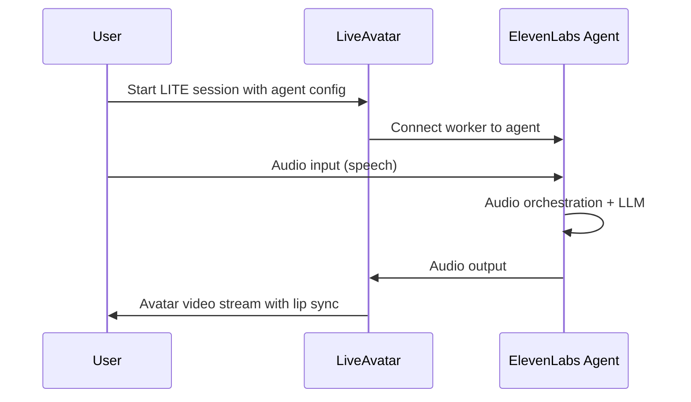

> This is a page from the ElevenLabs documentation. For a complete page index, fetch https://elevenlabs.io/docs/llms.txt. For the full documentation in a single file, fetch https://elevenlabs.io/docs/llms-full.txt.

# LiveAvatar

## Overview

The LiveAvatar integration connects ElevenAgents with HeyGen's [LiveAvatar](https://docs.liveavatar.com) platform to create interactive avatar experiences. This integration combines ElevenLabs Agents (handling audio interactions) with LiveAvatar's real-time avatar video streaming, enabling low-latency visual conversations with AI avatars.

With this integration you can:

* Deploy conversational AI agents with visual avatar representation
* Create interactive customer service experiences with lifelike avatars
* Build engaging virtual assistants for websites and applications

## How it works

The integration uses LiveAvatar's LITE session mode where responsibilities are divided between the two platforms:

* **ElevenLabs**: Handles the streaming and orchestration of audio input and output
* **LiveAvatar**: Manages avatar rendering and real-time video streaming

When a LITE mode session starts with an ElevenAgents configuration, LiveAvatar dispatches a worker that connects to your ElevenLabs agent. The agent's audio output drives the avatar's lip sync and animations in real-time.



## Prerequisites

Before setting up the integration, ensure you have:

1. An ElevenLabs account with API access
2. A HeyGen LiveAvatar account with API access
3. An ElevenLabs agent (create one following the [quickstart guide](/docs/eleven-agents/quickstart))

The ElevenLabs Agent needs to have audio input and output formats set to PCM 24000 Hz. This can be
set in Voice settings > TTS output formats, and Advanced > User input audio format.

## Setup

You need two items from your ElevenLabs account:

1. **Agent ID**: Navigate to [Agents Platform > Agents](https://elevenlabs.io/app/agents/agents) and copy the ID of the agent you want to use

2. **API Key**: Go to [Settings > API Keys](https://elevenlabs.io/app/settings/api-keys) and generate a new API key (or use an existing one)

The API key needs to have `convai_read`, `user_read`, and `voices_read` permissions.

LiveAvatar requires your ElevenLabs API key to be registered through their secrets endpoint. This registration encrypts your key using Amazon KMS and returns a `secret_id` for use in sessions.

Make a POST request to LiveAvatar's secrets endpoint:

```bash
curl -X POST "https://api.liveavatar.com/v1/secrets" \
  -H "Content-Type: application/json" \
  -H "X-Api-Key: <your_heygen_api_key>" \
  -d '{
    "secret_type": "ELEVENLABS_API_KEY",
    "secret_value": "<your_secret_value>",
    "secret_name": "<your_secret_name>"
  }'
```

The response contains your `secret_id`. Store this `secret_id` for use when starting sessions.

When starting a LiveAvatar session, use LITE mode and include your ElevenAgents configuration:

```json
{
  "mode": "LITE",
  "elevenlabs_agent_config": {
    "secret_id": "xxxxxxxxxxxxxxxx",
    "agent_id": "agent_xxxxxxxxxxxxxxxx"
  },
  "avatar_id": "xxxxx"
}
```

Refer to the [LiveAvatar session API documentation](https://docs.liveavatar.com) for complete details on session management.

## Events and callbacks

The integration delivers events through LiveKit rooms, using the same event structure as LiveAvatar's FULL mode. This allows you to:

* Monitor conversation state changes
* Track agent speaking and listening modes
* Handle connection and disconnection events
* Process transcriptions and agent responses

Configure your event handlers according to the [LiveAvatar events documentation](https://docs.liveavatar.com).

## Billing

This integration involves separate billing from both platforms:

| Component                      | Billing                                                                                            |
| ------------------------------ | -------------------------------------------------------------------------------------------------- |
| LiveAvatar (avatar video)      | 1 credit per session minute                                                                        |
| ElevenLabs (conversational AI) | Billed to your ElevenLabs account based on your [subscription plan](https://elevenlabs.io/pricing) |

The avatar streaming is billed only for the video component, while all agents usage (audio and LLM) is charged separately through your ElevenLabs account.

## Resources

* [LiveAvatar ElevenLabs Agent Plugin documentation](https://docs.liveavatar.com/docs/elevenlabs-agent-plugin)
* [LiveAvatar API reference](https://docs.liveavatar.com/reference)
* [ElevenAgents quickstart](/docs/eleven-agents/quickstart)
* [ElevenAgents API reference](/docs/api-reference/agents/create)